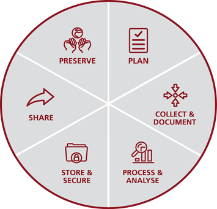
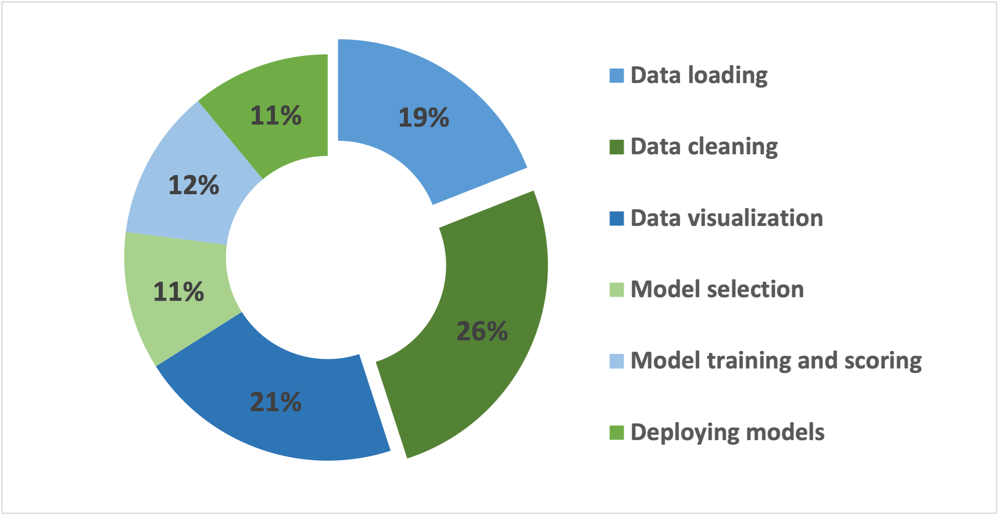
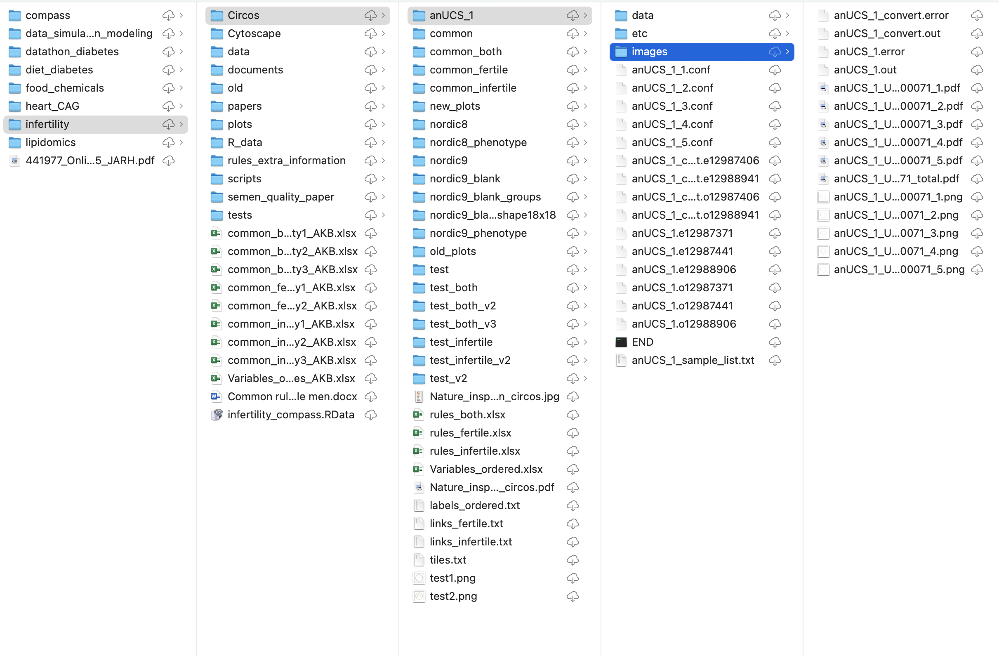
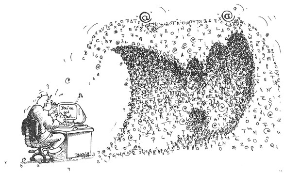

---
title: RDM intro
summary: An introduction to Research Data Management from the point of view of the University of Copenhagen.
---

# Introduction to Research Data Management

**Last updated:** *{{ git_revision_date_localized }}*

!!! note "Section Overview"

    &#128368; **Time Estimation:** X minutes  

    &#128172; **Learning Objectives:**    
        
    1. Learn the basics about what is Research Data Management
    2. Learn why good RDM are important

The University of Copenhagen (UCPH) defines Research Data Management (RDM) as a "collective term for the planning, collection, storage, sharing and preservation of research data"[@UCPH_guidelines].

RDM is of paramount importance in modern scientific investigations due to the exponential growth of data in various disciplines, particularly in fields like genomics, climate research, and social sciences. Effectively managing research data offers several key benefits:

- First, it enhances the reliability and credibility of research findings by providing a transparent and structured approach to data collection, organization, and analysis.
- Second, RDM promotes data discoverability, allowing researchers to locate and utilize existing data for new investigations, thus maximizing the value of research efforts.
- Third, proper data management facilitates collaboration and knowledge sharing within the scientific community, accelerating the pace of discoveries and advancements. 
- Finally, RDM ensures compliance with ethical and legal requirements, safeguarding sensitive data and promoting responsible data use. By adopting robust RDM practices, researchers can optimize their workflow, increase research impact, and contribute to the overall progress of science.

## What is Research Data Management

While the meaning of Research Data Management might be obvious, it is a good idea to break down its components to make a good sense of what it implies. Let's start with *Management*, which is rather simple!

!!! note "Meaning of Management"

    The literal [meaning](https://www.merriam-webster.com/dictionary/management) of *Management* is "the practice of managing; handling, supervision, or control."

On the other hand, we have *Research Data*:

!!! note "Meaning of Research Data"

    In accordance with the UCPH Policy for Research Data Management[@UCPH_guidelines], research data encompasses both physical material and digital information gathered, observed, produced, or formulated during research activities carried out at UCPH. This broad definition includes various types of data serving as the foundation for the research, such as specimens, notebooks, interviews, texts, literature, digital raw data, recordings, computer code, and meticulous documentation of these materials and data, forming the core of the analysis that underlies the research outcomes.

So, our goal is to handle and control the data that we generate during our research, including **both physical and digital** data! This must be done **throughout the whole life [cycle of the data](#research-data-cycle)**.

Nonetheless, we will focus on the **digital part** of our data.

!!! warning

    This workshop focuses on RDM of digital data and how it was generated!

### Research Data Cycle

The Research Data Life Cycle is a conceptual framework that illustrates the various stages that research data goes through during its lifetime, from its initial creation or collection to its eventual archiving or disposal. It provides a structured approach to managing research data effectively, ensuring data integrity, accessibility, and reusability. We will talk about the Research Data Life Cycle in the [third lesson](./03_data_life_cycle.md).

<figcaption>Research Data Life Cycle, University of Copenhagen RDM guidelines.</figcaption>

## Why is Research Data Management important

Effective data management can significantly benefit research, providing advantages for individual researchers:

- Careful planning aids in the early identification and resolution of potential issues, aligns expectations among collaborators, and clarifies data rights and ownership.
- Thorough data documentation streamlines the process of locating and comprehending previous research, promoting efficiency and building upon existing knowledge.
- Conducting risk assessments and devising robust data storage and security strategies mitigate the risk of data loss, breaches, or unauthorized use, safeguarding valuable research assets.
- Sharing data with others beyond the project's conclusion enhances research visibility and fosters increased citations, expanding the impact of the findings.
- Developing a data preservation plan ensures the long-term availability of research data well after the project's completion, contributing to data accessibility and continued research relevance.

### The cost of bad RDM practices

Several surveys have shown that data scientists spend between 40-60% of their time loading and cleaning data, becoming the most consuming tasks and many would call it tedious of their jobs[@anaconda_report;@forbes_article]. Below we show the number figures from the [Anaconda "State of data science 2020" report](https://www.anaconda.com/resources/whitepapers/state-of-data-science-2020)[@anaconda_report].

<figcaption>Time spent in different tasks by data scientists, Anaconda State of data science report 2020.</figcaption>

Could you think why? Maybe this pictures look familiar to you...

<a href="https://www.su.se/staff/researchers/research-data/manage-store-data">

<figcaption>Photo by Wonderlane on Unsplash.</figcaption>
</a>

<figcaption>Messy folder structure, by my old-self.</figcaption>

Or ever felt like this?

<a href="https://reproducibility.stanford.edu/how-not-to-get-lost-in-your-data/">

<figcaption>From Stanford Center for Reproducible Neuroscience.</figcaption>
</a>

What about these situations? Have you ever encounter any?

1. Imagine a researcher working on a project without a clear folder structure or meaningful file names for their data. As the project progresses and data accumulates, it becomes challenging for the researcher to locate specific data files quickly. This leads to wasted time searching for relevant information and delays in data analysis.
2. Suppose a researcher does not document their data collection methods adequately. When another researcher attempts to analyze the data later, they struggle to understand the context in which the data was gathered, leading to misinterpretations and errors in the analysis.
3. A researcher publishes a groundbreaking study, but their data and methods lack proper documentation and are not made available to others. As a result, other researchers find it challenging or impossible to reproduce the study's results, leading to doubts about the validity of the findings.
4. Suppose a research team spends weeks trying to clean and validate poorly organized data before they can start their analysis. This wasted time and effort could have been better spent on more productive research tasks.

Bad data management practices can have significant consequences that affect both your future self and colleagues who may have to deal with your data, as well as those handling other people's data. The implications of poor data management include:

- **Difficulty in Data Retrieval**: Without proper organization and documentation, finding specific data files or understanding their content becomes challenging and time-consuming. This leads to inefficiency and frustration when attempting to retrieve relevant information.
- **Loss of Data**: Inadequate data backup and storage strategies increase the risk of data loss due to hardware failures, accidental deletions, or other unforeseen events. Losing valuable research data can be devastating and may result in the loss of months or even years of work.
- **Data Incompleteness and Errors**: Insufficient data documentation can lead to ambiguity and errors in data interpretation and analysis. This can undermine the credibility and reliability of research outcomes.
- **Difficulty in Reproducibility**: Inability to reproduce research results due to poor data management hinders scientific progress and challenges the validity of research findings.
- **Delayed or Compromised Collaboration**: In collaborative research projects, disorganized or poorly managed data can slow down progress and hinder effective communication among team members.
- **Data Security and Privacy Risks**: Inadequate data security measures can result in data breaches, compromising the confidentiality of sensitive information and exposing researchers and subjects to potential risks.
- **Wasted Time and Resources**: Poor data management practices necessitate additional time and effort to clean, validate, and organize data, diverting valuable resources from actual research tasks.
- **Financial Implications**: Time-consuming data management tasks translate to increased labor costs and potential project delays. Additionally, data loss may require costly data recovery attempts or, in extreme cases, data reconstruction.
- **Reputational Damage**: Inaccurate or irreproducible research outcomes can damage a researcher's reputation and credibility within the scientific community.

By not practicing proper data management, researchers risk impeding their own progress and the progress of others who rely on their data. Furthermore, dealing with poorly managed data from others can be equally time-consuming and resource-intensive. To address these challenges, researchers could prioritize effective data management practices, including proper data organization, documentation, backup strategies, and adherence to data security and preservation protocols. Investing time and effort into good data management can prevent unnecessary setbacks, ensure data integrity, and ultimately contribute to more robust and reliable scientific research.

### Benefits of good RDM practices

Let's see what could we have done to avoid or fix the issues we have previously mentioned:

1. To avoid this, the researcher could have implemented a clear and consistent folder structure with descriptive file names. Additionally, using version control systems, such as Git, for code and analysis files can help track changes and facilitate easy retrieval.
2. Proper data documentation, including detailed metadata, could have been maintained throughout the data collection process, providing necessary context and reducing the risk of incomplete or ambiguous data.
3. The researcher could have followed the FAIR principles (Findable, Accessible, Interoperable, Reusable) by making their data, along with detailed methods and documentation, openly accessible in a reputable data repository.
4. By implementing data management strategies from the outset of the research project, researchers can save time and resources later on, ensuring that data is well-organized and properly documented.

All in all, good data management absolutely have a positive impact on research. For individual researchers:

- Good planning can help identify issues before they become a problem, and help align expectations between collaborators, for examples concerning rights to data.
- Good data documentation can facilitate finding and understanding past research.
- Conducting risk assessments and making a strategy for data storage and security can prevent data loss, data breaches or data misuse.
- Sharing data with others after project end can enhance the visibility of research and lead to an increase in citations.
- Drafting a data preservation plan can help ensure the availability of research data for years after the end of the project.​

We will see different resources, tools and guidelines that can be applied to all kinds of data, and we will also talk more about specific examples for NGS data in the next sections.