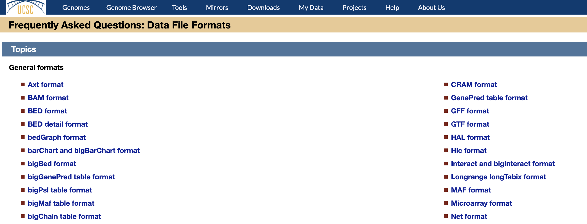

---
title: Next Generation Sequencing Data
summary: In this lesson we talk about what is NGS, and what kind of data falls under this field
tags:
    - NGS
    - Bioinformatics data
    - Data formats
---

# Next Generation Sequencing data

**Last updated:** *{{ git_revision_date_localized }}*

!!! note "Section Overview"

    &#128368; **Time Estimation:** X minutes  

    &#128172; **Learning Objectives:**    
    
    1. Learn about what is Next Generation Sequencing  
    2. Learn about different types of NGS data
    3. Learn about the specific challenges regarding RDM for NGS data

In this session, we'll explore the essentials of Next Generation Sequencing technology, which generates vast data volumes in a single experiment. We'll examine the types of data produced during an NGS experiment and the results created from the downstream analysis. Moreover, we'll address specific challenges NGS encounters in RDM, such as, managing genomic resources, pipelines/workflows, data analysis, data preservation and documentation. We will also mention briefly concerns regarding sensitive data and GDPR protection of NGS data.

## What is Next Generation Sequencing

Next Generation Sequencing (NGS), also known as high-throughput sequencing, is a revolutionary technology that has transformed genomics research in recent years. NGS is a suite of advanced DNA sequencing techniques that enable rapid and cost-effective analysis of DNA or RNA molecules. Unlike traditional Sanger sequencing, which could only sequence a limited number of DNA fragments at a time, NGS can analyze millions of DNA fragments simultaneously in a single run. This massive parallel sequencing capacity has drastically increased the speed, efficiency, and scale of DNA sequencing, making it an indispensable tool in modern genomics and biomedical studies.

NGS workflows encompass key steps, starting with sample preparation, where DNA or RNA is extracted and fragmented into smaller segments. Subsequently, unique identifiers are added to the fragments during library preparation, enabling multiplexed sequencing. The fragments are then amplified and sequenced in parallel using state-of-the-art NGS platforms. Finally, data analysis methods are applied to process the raw sequencing data, reconstruct the original DNA or RNA sequence, and identify genetic variations, structural changes, or functional elements.

The versatility of NGS extends far beyond genome sequencing. It is widely utilized in various applications, including transcriptome analysis (RNA-Seq), epigenetic profiling (ChIP-Seq), metagenomics, and targeted sequencing. NGS has revolutionized fields like oncology, infectious disease research, and personalized medicine, as its ability to generate vast amounts of data rapidly provides unprecedented insights into the genetic basis of diseases and biological processes. As NGS technologies continue to advance and become more accessible, they will remain at the front of cutting-edge genomics research, driving innovations that contribute to our understanding of complex genetic interactions and their implications for human health and biology.

## Data produced during an NGS experiment

During an NGS experiment, various types of data are generated, including everything needed to create and prepare the samples used for sequencing. These compass, between others, laboratory protocols, lab notebooks, NGS libraries and the sequencing data itself.

### Electronic Laboratory Notebook

An electronic laboratory notebook (ELN) is a digital version of the traditional paper notebook used by scientists, researchers, and professionals in laboratories and research settings. It serves as a platform for recording, organizing, and managing experimental data, observations, protocols, and other research-related information in electronic format. ELNs offer a range of features including data entry, text editing, file attachments, collaboration tools, and data search capabilities. They provide advantages over paper notebooks by enabling easy data retrieval, backup, and sharing, as well as facilitating collaboration among researchers.

### Laboratory protocols

A laboratory protocol is documented set of procedures and methodologies outlining the precise steps required to prepare and manage samples of an experiment.

### Samples

In the context of molecular biology and Next-Generation Sequencing (NGS), a sample refers to a specific biological material or substance that is collected and prepared for genetic analysis. This material can encompass various biological entities such as DNA, RNA, or proteins, depending on the objectives of the study. For instance, a DNA sample might be extracted from a tissue or blood sample to analyze genetic variations or sequences. In NGS experiments, samples are typically processed according to specific protocols to generate large amounts of sequencing data, allowing researchers to delve into the genetic information contained within the sample.

!!! note "Bioinformatics data from your samples"

    The experimental conditions of each of the samples should be registered in a metadata file that can be used later in your data analyses, such as treatment, cell type, timepoints, etc.

### Library Preparation

After preparing your samples, the next step in an NGS experiment is the library preparation, where DNA or RNA samples are processed to create DNA fragments with specific adapter sequences. These adapters contain unique barcode sequences that allow the identification of individual samples within a multiplexed sequencing run.

### Sequencing

Once the libraries are prepared, they undergo the sequencing process using NGS platforms such as Illumina, Oxford Nanopore Technologies (ONT), or Pacific Biosciences (PacBio). The choice of platform depends on factors such as read length, error rate, throughput, and cost. The sequencing generates millions to billions of short DNA or RNA fragments, known as reads.

The sequencing process produces raw data in the form of short reads, each representing a small segment of the genome or transcriptome. These reads are typically stored in FASTQ files, which contain nucleotide sequences and corresponding quality scores for each read.

!!! note "Bioinformatics data from sequencing"

    - **FASTQ:** This is one of the primary file formats used to store raw NGS data. FASTQ files contain nucleotide sequences and their corresponding quality scores. Each read from the sequencing process is represented as a set of four lines: a read identifier, the sequence of nucleotides, a separator (usually a '+'), and the quality scores for each base in the sequence.

## Data produced during preprocessing

### Quality Control

Before proceeding with data analysis, quality control is performed to assess the accuracy and reliability of the raw sequencing data. Low-quality reads and potential sequencing artifacts are filtered out to ensure the reliability of downstream analyses. Most useful tools to track Quality Control are FastQC and MultiQC.

!!! "Bioinformatics data from QC"

    - **FastQC**: FastQC is a widely-used bioinformatics tool that provides a comprehensive assessment of the quality of sequencing data, generating valuable insights into potential issues or biases in the data. 
    - **MultiQC**: MultiQC is a companion tool that simplifies the process of aggregating and visualizing quality control metrics from multiple samples or datasets, allowing for a quick overview of data quality across an entire project.

### Data Alignment

In DNA sequencing, the reads are aligned to a reference genome using alignment algorithms to determine the specific location of each read in the genome. For RNA-Seq experiments, reads are aligned to a reference transcriptome to identify gene expression levels.

!!! "Bioinformatics data from alignment"

    - **BAM/SAM**: These are binary and text versions, respectively, of Sequence Alignment/Map (SAM) files. SAM files store the alignment information of sequencing reads to a reference genome or transcriptome. BAM files are compressed and more space-efficient, making them the preferred format for storing aligned reads.
    - **FASTA**: FASTA files store nucleotide or amino acid sequences, and they are often used for reference sequences or assembled contigs. Each sequence in a FASTA file begins with a single-line description, followed by the actual sequence data.
    - **GTF/GFF**: These files are used to annotate genomic features, such as genes, exons, and transcripts. Gene Transfer Format (GTF) and General Feature Format (GFF) files include information on feature positions, names, and additional attributes.
    - **Alignment indexes**: These are reference data structures that facilitate efficient and rapid mapping of sequencing reads to a reference genome or transcriptome during Next Generation Sequencing (NGS) data analysis.

### Variant Calling

For genomic DNA sequencing, variant calling identifies differences (mutations, insertions, deletions) between the sequenced sample and the reference genome. This step is crucial for detecting genetic variations associated with diseases or phenotypic traits.

!!! "Bioinformatics data from VC"

    - **VCF**: Variant Call Format (VCF) files store genetic variations, such as single nucleotide variants (SNVs), insertions, deletions, and structural variants, identified during variant calling. VCF files include variant position, alleles, genotype information, and quality scores.

### RNA Expression Analysis

In RNA-Seq experiments, data analysis includes quantification of gene expression levels, detection of alternative splicing events, and identification of differentially expressed genes under different experimental conditions.

!!! "Bioinformatics data from Expression Analyses"

    - **Count matrix**: represents the quantified number of times each gene or genomic feature is observed in a set of biological samples. Each row typically corresponds to a gene, while each column represents a sample.

### Epigenetic Profiling

Epigenetic analyses, such as ChIP-Seq, assess DNA modifications and protein-DNA interactions, providing insights into gene regulation and chromatin structure.

!!! "Bioinformatics data from Epigenetic profiling"

    - **Peak Calling Results**: For ChIP-Seq or other genomic profiling experiments, peak calling identifies regions with enriched signal intensity. The results are typically presented in BED or BEDGraph formats, indicating the genomic positions and signal intensities of detected peaks, or BigWig files for visualization in a genome browser.
    - **BED/BEDGraph**: These files are used to represent genomic intervals, such as gene coordinates, regions of interest, or coverage information. BED files define genomic regions with start and end coordinates, while BEDGraph files represent continuous data (e.g., coverage) as a graph.
    - **WIG/BigWig**: These files store genome-wide data, such as coverage, signal intensity, or ChIP-Seq peaks. Wiggle (WIG) files contain continuous data, while BigWig files are binary, compressed versions that enable efficient random access to large datasets.

### Metagenomic Analysis

For metagenomics, the NGS data is used to characterize microbial communities in environmental samples, including the identification of species and functional genes. Overall, the data generated during an NGS experiment is extensive and diverse, providing a wealth of information that is crucial for a wide range of biological and medical research applications. The interpretation and analysis of this data require sophisticated bioinformatics tools and pipelines, as well as domain-specific knowledge to derive meaningful biological insights.

### Other types of data

There are many more data formats we have not explored here. You are welcome to check more bioinformatics data formats at the [UCSC webpage](http://genome.ucsc.edu/FAQ/FAQformat).

!!! tip "Bioinformatics data format tutorial"

    Check out [this tutorial](https://bioinformatics.uconn.edu/resources-and-events/tutorials-2/file-formats-tutorial/) for a more in-depth explanation of different bioinformatics data formats

## Data produced during data analysis

Results from NGS data analysis often involve a variety of visualizations and tabular outputs that provide valuable insights into the biological significance of the data. Here are some common types of results that researchers may obtain from NGS data analysis.

### Variant Annotation

After variant calling, the identified genetic variations are annotated with functional information, such as their impact on genes, regulatory elements, or protein products.

### Differential Expression Analysis

Differential Expression Analysis Tables: Differential expression analysis compares gene expression levels between different experimental conditions or groups. The results are typically presented in tabular format, listing genes with significant changes in expression, along with log-fold changes and statistical significance values.

### Differential Binding or Chromatin Accesibility Analysis

Differential Binding Analysis Tables: Differential expression analysis compares chromatin accessibility or binding levels between different experimental conditions or groups. The results are typically presented in tabular format, listing genes with significant changes in binging or chromatin accesibility, along with log-fold changes and statistical significance values.

### Functional analysis

Functional analysis identifies functional categories, pathways, or gene sets that are significantly overrepresented in a list of differentially expressed genes. The results are presented as tables with enrichment scores and adjusted p-values, indicating the biological relevance of gene sets.

### Metagenomic Analysis

Metagenomic Taxonomic Abundance Tables: In metagenomics, taxonomic abundance tables show the relative abundance of different microbial taxa across multiple samples. They are essential for understanding the composition of microbial communities.

Metagenomic Functional Analysis Results: Metagenomic functional analysis identifies the functional capabilities of microbial communities. Results are typically presented as tables showing the relative abundance of functional genes or pathways.

## Other types of data

These results from NGS data analysis play a crucial role in interpreting the biological significance of the data, enabling researchers to draw meaningful conclusions and generate hypotheses for further investigation. Effective data visualization and clear tabular outputs are essential for effectively communicating and interpreting the wealth of information generated by NGS experiments.

!!! note "Bioinformatics visualizations"

    - **Heatmaps**: Heatmaps are graphical representations of data matrices, where each cell's color intensity reflects the value of a specific parameter. In NGS data analysis, heatmaps are frequently used to visualize gene expression patterns, epigenetic modifications, or microbial abundances across different samples or conditions.
    - **Volcano Plots**: Volcano plots display the relationship between fold change (usually log-fold change) and statistical significance (e.g., p-value) for each gene in a differential analysis. Genes with high significance and large fold changes are often represented further away from the plot's center.
    - **Genome Browser Snapshots**: Genome browser snapshots display aligned sequencing reads and various genomic features (e.g., gene annotations, ChIP-Seq peaks) in a genomic region of interest. These snapshots provide a visual representation of NGS data aligned to a reference genome.
    - **Network Visualizations**: Network visualizations depict the interactions between genes, proteins, or other biological entities, providing insights into complex biological networks. These visualizations can help uncover regulatory relationships or functional modules.
    - **Genomic Annotations**: Results may include annotations for genetic variations, such as their functional impact on genes, genomic regions, or regulatory elements.

## Other resources used

### Knowledge databases

A knowledge database is a structured repository of biological information that categorizes and annotates genes, proteins, and their functions, facilitating comprehensive understanding and analysis of biological systems. Here are five examples of knowledge databases:

1. **Gene Ontology (GO)**: A comprehensive resource that classifies gene functions into defined terms, allowing for standardized annotation and comparison of genes across different organisms.
2. **Disease Ontology**: A database that provides structured, standardized terminology for various diseases and their relationships, aiding in the systematic analysis of disease-related data.
3. **KEGG Pathways**: A collection of manually curated pathway maps representing molecular interactions and reaction networks within cells, enabling the interpretation of high-throughput data in the context of biological systems.
4. **Reactome**: An open-access database that offers curated descriptions of biological processes, including pathways, reactions, and molecular events, facilitating the interpretation of large-scale biological data.
5. **UniProt**: An extensive protein knowledgebase that provides detailed information about proteins, including their sequences, functions, and related annotations, supporting a wide range of biological research endeavors.

### Code notebooks and scripts

Code notebooks and scripts are essential tools used to analyze Next Generation Sequencing (NGS) data, providing researchers with a documented and reproducible workflow for data processing, and analyses. Common programming languages (and notebooks) are: Python (Jupyter Notebooks), R (Rmarkdown), perl and bash.

### Workflows and pipelines

These are structured sets of interconnected data analysis steps and bioinformatics tools that streamline and automate the transformation of raw sequencing reads into biologically meaningful information, ensuring reproducibility and efficiency in NGS data analysis. Some examples of workflow and pipeline languages are:

- **Nextflow**: Nextflow is a popular workflow management system that enables scalable and portable NGS data analysis pipelines, allowing researchers to process data across various computing environments and platforms.
- **Snakemake**: Snakemake is a workflow management system that uses Python-based scripting to create flexible and automated NGS data analysis pipelines, facilitating parallel processing and easy integration with existing tools.

A great example of community curated workflows is the nf-core community. Nf-core is a collaborative and open-source initiative comprising bioinformaticians and researchers dedicated to developing and maintaining a collection of curated and reproducible Nextflow-based pipelines for NGS data analysis, ensuring standardized and efficient data processing workflows.

## Data formats summary

Here is a summary of different file formats used for NGS data and its results. It's important to select appropriate file formats that balance data accessibility, storage efficiency, and compatibility with downstream analysis tools. Additionally, the use of standardized file formats facilitates data sharing and collaboration among researchers in the scientific community.

- Tabular formats: File formats like CSV, TSV, and XLSX used to store data in rows and columns for easy data analysis and sharing.
- Image formats: File formats such as PNG and SVG used to store graphical visualizations, making them easily viewable and shareable.
- Binary formats: File formats like NPZ and H5 used to store large datasets, ensuring efficient data access and storage.
- BED: A format for storing genomic interval data, often used for representing genomic features and peak calling results.
- GTF: A format for storing genomic feature annotations, such as genes and transcripts, providing information on their positions and attributes.
- VCF: Variant Call Format used to store genetic variations and their attributes identified during variant calling.
- JSON: A lightweight data-interchange format for storing hierarchical data structures, commonly used in bioinformatics tools.
- HTML: A format used to create interactive reports that include both visualizations and textual descriptions of analysis results.
- FASTQ: A format for storing raw NGS data, containing nucleotide sequences and quality scores for each read.
- FASTA: A format for storing nucleotide or amino acid sequences, often used for reference sequences or assembled contigs.
- BAM/SAM: BAM is A binary format used to store compressed alignment data, representing aligned reads to a reference genome. SAM is a text version of the BAM format, representing aligned reads to a reference genome.
- Alignment indexes: Reference data structures facilitating efficient mapping of reads to a reference genome during NGS data analysis.
- FASTQC: A tool generating quality control reports for raw NGS data, assessing read quality and detecting potential issues.
- MultiQC: A tool aggregating results from multiple QC analyses, simplifying the overview and comparison of multiple datasets.
- Code notebooks: Interactive documents combining code, visualizations, and explanatory text, aiding in data analysis reproducibility and documentation.
- Scripts: Text files containing sets of commands or code instructions for automating data processing and analysis tasks.

## Wrap up

In this lesson we have taken a look a the vast and diverse landscape of bioinformatics data. This should give you a start in understanding the type of data we will be focusing on for the next lessons. In the next chapter we will talk about its [life cycle](./03_data_life_cycle.md), which will give you an idea about what do you need to pay attention in order to organize, document and share your data.
