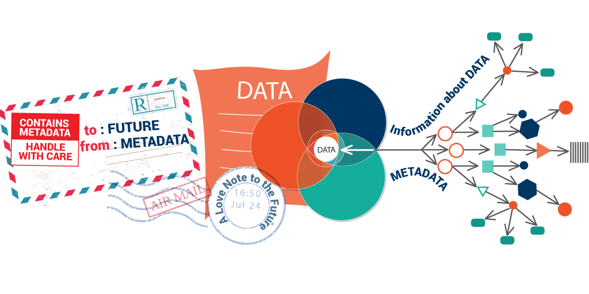

---
title: Metadata for NGS data
summary: A brief description of my document.
---

# Metadata for NGS data

**Last updated:** *{{ git_revision_date_localized }}*

!!! note "Section Overview"

    &#128368; **Time Estimation:** X minutes  

    &#128172; **Learning Objectives:**    
        
    1. Learn what is metadata  
    2. Learn what metadata is associated to NGS data
    3. Learn sources for controlled vocabularies for NGS data

Metadata is the behind-the-scenes information that makes sense of data. It's the extra layer of details that help you understand what the data is all about. Imagine you have a book – the words on the pages are the data, while the title, author, and table of contents are the metadata. In a similar way, metadata gives data context and structure. For NGS data, metadata includes information such as when and where the data was collected, what it represents, and how it was processed. In this section, we will explore what kind of relevant metadata is available for NGS data, and how to capture it in your [Assays or Project folders](./06_file_structure.md).

## What is metadata and why it is important


*From [ontotext.com](https://www.ontotext.com/knowledgehub/fundamentals/metadata-fundamental/)*

Imagine you have a batch of DNA sequences from different people. The raw sequences are like jigsaw puzzle pieces, and metadata is a cheat sheet that tells you which pieces fit where. It could include details like when and where the samples were collected, the lab procedures used, who did created them, and even the equipment involved, providing context and making sense of the who, what, when, where, and why.

!!! note "Definition of metadata"

    Metadata refers to data that provides information about other data. It describes various aspects of the data, such as its origin, structure, format, and context. Metadata is typically used to facilitate the organization, management, and interpretation of data, making it easier to locate, access, and understand. In essence, metadata adds valuable context and attributes to the primary data, enhancing its usability and ensuring efficient data management."

Let's think of an example that shows why metadata is extremelly important. Imagine you're in a big lab with a plethora of different datasets all saved under generic folder names. Without metadata, it would be like searching for a needle in a haystack. You'd have folders labeled 'Experiment123,' 'DataBatch42,' and so on, but zero clues about what's inside. With metadata, 'Experiment123' is not just that anymore, but 'DNA Sequencing of Human Cells, March 2023'. Providing relevant metadata converts data chaos into an organized repository, turning data exploration, interpretation, and insight extraction into a much easier journey. This is true not only for yourself or your lab, but to other researchers that might want to reuse your data. Collecting metadata from the very beginning of the research project will help tremendously to alleviate future efforts to understand the data. It can also help you make an organised collection of data, so that you do not lose any information regarding the data, or that you do not repeat an unnecessary experiment that someone else has done it before, but you could not find. That is, it helps you save money and time!

!!! note "Benefits of collecting proper metadata"

    1. **Data Context and Interpretation**: Metadata provides crucial context to NGS data, offering insights into the experimental conditions, sample origins, and processing methods. This context is vital for understanding data variations, drawing accurate conclusions, and interpreting results correctly.
    2. **Data Discovery and Access**: With metadata, researchers can easily locate and access specific NGS datasets within large repositories. Details like sample identifiers, experimental parameters, and timestamps help researchers quickly identify relevant data for their analyses.
    3. **Reproducibility and Collaboration**: Metadata ensures that NGS experiments can be replicated and validated by others. By sharing comprehensive metadata, researchers enable colleagues to reproduce analyses, compare results, and collaborate effectively, bolstering the integrity of scientific findings.
    4. **Quality Control and Validation**: Metadata supports data quality assessment by allowing researchers to track the origin and handling of NGS data. It enables the identification of potential errors or biases, helping researchers validate the accuracy and reliability of their analyses.
    5. **Long-Term Data Preservation**: Properly documented metadata is essential for preserving NGS data over time. As research evolves, metadata ensures that future generations can understand and utilize archived NGS datasets, ensuring the continued impact of scientific discoveries.

## How to collect metadata in your folders

In our previous lesson, we learnt about how to organize your data into different types of folders: `Assays` and `Projects`. Both of these folders contain a metadata.yml file and a README.md file. In this section, we will check what kind of information you should collect in each of these files.

### README.md file

The README.md file is a [markdown file](https://www.markdownguide.org/) that allows you to write a long description of the data placed in a folder. Since it is a markdown file, you are able to write in rich text format (bold, italic, include links, etc) what is inside the folder, why it was created/collected, how and when. If it is an `Assay` folder, you could include the laboratory protocol used to generate the samples, images explaining the experiment design, a summary of the results of the experiment and any sort of comments that would help to understand the context of the experiment. On the other hand, a 'Project' README file may contain a description of the project, what are its aims, why is it important, what 'Assays' is it using, how to interpret the code notebooks, a summary of the results and, again, any sort of comments that would help to understand the project.

Here is an example of a README file for a `Project`` folder:

```
# NGS Analysis Project: Exploring Gene Expression in Human Tissues

## Aims

This project aims to investigate gene expression patterns across various human tissues using Next Generation Sequencing (NGS) data. By analyzing the transcriptomes of different tissues, we seek to uncover tissue-specific gene expression profiles and identify potential markers associated with specific biological functions or diseases.

## Why It's Important

Understanding tissue-specific gene expression is crucial for deciphering the molecular basis of health and disease. Identifying genes that are uniquely expressed in certain tissues can provide insights into tissue function, development, and potential therapeutic targets. This project contributes to our broader understanding of human biology and has implications for personalized medicine and disease research.

## Datasets

We have used internal datasets with IDs: RNA_humanSkin_20201030, RNA_humanBrain_20210102, RNA_humanLung_20220304.

In addition, we utilized publicly available NGS datasets from the GTEx (Genotype-Tissue Expression) project, which provides comprehensive RNA-seq data across multiple human tissues. These datasets offer a wealth of information on gene expression levels and isoform variations across diverse tissues, making them ideal for our analysis.

## Summary of Results

Our analysis revealed distinct gene expression patterns among different human tissues. We identified tissue-specific genes enriched in brain tissues, highlighting their potential roles in neurodevelopment and function. Additionally, we found a set of genes that exhibit consistent expression across a range of tissues, suggesting their fundamental importance in basic cellular processes.

Furthermore, our differential expression analysis unveiled significant changes in gene expression between healthy and diseased tissues, shedding light on potential molecular factors underlying various diseases. Overall, this project underscores the power of NGS data in unraveling intricate gene expression networks and their implications for human health.

---

For more details, refer to our [Jupyter Notebook](link-to-jupyter-notebook.ipynb) for the complete analysis pipeline and code.
```

### metadata.yml

The metadata file is a [yml file](https://fileinfo.com/extension/yml), which is a text document that contains data formatted using a human-readable data format for data serialization. It is not mandatory that you use yml format, any other structured file format will work too, such as json files. We recommend using yml format because it is easily readable for humans, so non-coding people will have an easier time checking, writing or modifying the file if they need to.


## Metadata fields

There is a ton of information you can collect regarding an NGS assay or a project. Some information fields are very general, such as author or date, while others are specific to the Assay or Project folder. Below, we will take a look at minimal information you should collect in each of the folders. But before that, we need to talk about controlled vocabularies/ontologies.

Imagine this scenario: a researcher in genomics us excited to explore various NGS datasets from different human tissue samples to study gene expression patterns. However, she encounters a significant hurdle: the tissue names used in the datasets are inconsistent and lack standardized terms. Some datasets refer to "brain," while others use "cerebral cortex" or "cortical tissue." This lack of controlled vocabularies for tissue names complicates her data integration efforts, requiring her to spend additional time curating and mapping tissue labels to establish meaningful cross-dataset comparisons.

So, what happened here?  If the original creators of the NGS datasets had adopted a standardized vocabulary for tissue names, Dr. Smith could have seamlessly integrated the data without the need for extensive curation. By employing a widely accepted tissue ontology, like the Uberon Ontology, dataset contributors could have consistently used predefined terms, such as "brain" or "cerebral cortex." This practice would have not only simplified data integration but also facilitated accurate cross-dataset comparisons and enabled more reliable downstream analyses.

In the context of NGS data, ontologies and controlled vocabularies play a pivotal role in clarifying and categorizing many concepts and information about your data. More examples are: the Gene Ontology (GO), which provides a shared vocabulary to describe gene functions, molecular processes, and cellular components, enhancing the consistency and comparability of NGS results, and Ensembl gene IDs, which are used to uniquely represent individual genes and provide a standardized way of referencing and accessing gene-related information across various species. By leveraging ontologies, researchers ensure that metadata fields capture specific details consistently across experiments, from sample sources and protocols to experimental conditions.

!!! note "Definition of ontology"

    An ontology is a formal representation of knowledge that encompasses concepts, their attributes, and the relationships between them within a particular domain or subject area. It serves as a structured framework for organizing and categorizing information, facilitating the interpretation, sharing, and integration of knowledge across diverse applications and disciplines. Ontologies employ standardized vocabularies and define the semantics of terms, enabling effective communication and reasoning among humans and computer systems. They play a pivotal role in knowledge representation, data integration, and semantic interoperability, contributing to enhanced understanding, collaboration, and analysis within complex domains.

This standardization not only enhances data discoverability and interoperability but also empowers robust data analysis, accelerates knowledge sharing, and enables meaningful cross-study comparisons. In essence, ontologies serve as the universal translators of the scientific language, fostering a harmonious symphony of data interpretation and collaboration.

### General metadata fields

Here you can find a list of suggestions for general metadata fields that can be used for both assays and project folders:

- **Title**: A brief yet informative name for the dataset.
- **Author(s)**: The individual(s) or organization responsible for creating the dataset. You can use your [ORCID](https://orcid.org/)
- **Date Created**: The date when the dataset was originally generated or compiled. Use YYYY-MM-DD format!
- **Date Modified**: The date when the dataset was last updated or modified. Use YYYY-MM-DD format!
- **Object ID**: The project or assay ID for tracking and reference purposes.
- **Description**: A short narrative explaining the content, purpose, and context.
- **Keywords**: A set of descriptive terms or phrases that capture the folder's main topics and attributes.
- **Ethical and Legal Considerations**: Information about ethical approvals, consent, and any legal restrictions.
- **Version**: The version number or identifier for the folder, useful for tracking changes.
- **Related Publications**: Links or references to any scientific publications associated with the folder. Try to add here the DOI!
- **Funding Source**: Details about the funding agency or source that supported the research and data generation.
- **License**: The type of license or terms of use associated with the dataset/project.
- **Contact Information**: Contact details for individuals who can provide further information about the dataset/project.

### Assay metadata fields

Here you will find a table with possible metadata fields that you can use to annotate and track your `Assay` folders:

{{ read_table('./assets/assay_metadata.tsv') }}

### Sample metadata fields

There is some information that will be specific to your samples. For example, which samples are treated, which are control, which tissue do they come from, which cell type, etc. In this case, it would be beneficial if you include all this information in the [`samplesheet.csv`](./06_file_structure.md) that describes the fastq files. Here is a list of possible metadata fields that you can use:

{{ read_table('./assets/sample_metadata.tsv') }}

### Project metadata fields

Here you will find a table with possible metadata fields that you can use to annotate and track your `Project` folders:

In development.

{{ read_table('./assets/project_metadata.tsv') }}

## More info

The information provided in this lesson is not at all exhaustive. There might be many more fields and controlled vocabularies that could be useful for your NGS data. We recommend that you take a look at the following sources for more information!

- [Transcriptomics metadata standards and fields](https://faircookbook.elixir-europe.org/content/recipes/interoperability/transcriptomics-metadata.html#analysis-metadata)
- [Bionty](https://lamin.ai/docs/bionty): Biological ontologies for data scientists.

!!! question "Exercise: modify the metadata files in your cookiecutter templates"

    We have seen some examples of metadata for NGS data. It is time now to customize your cookiecutter templates and modify the metadata.yml files so that they fit your needs! 
    
    1. Think about what kind of metadata you would like to include.
    2. Modify the `cookiecutter.json` file so that when you create a new folder template, all the metadata is filled accordingly.
    
    3. Modify the `metadata.yml` file so that it includes the metadata recorded by the `cookiecutter.json` file.
    
    4. Modify the `README.md` file so that it includes the short description recorded by the `cookiecutter.json` file.
    5. Git add, commit and push the changes of your template.
    6. Test your folders by using the command `cookiecutter <URL to your cookiecutter repository in GitHub>`

## Wrap up

In this lesson we have learned about what metadata should be attached to your data in order to be reusable and understood in the future. Not only that, the metadata provided can help to process your samples adequately, and could even be useful for metadata studies. We have also briefly introduced some controlled vocabularies and sources for different fields, such as Disease Ontologies, Cell type ontologies, Organisms, etc. However, since this course is not aimed at enforcing the use of these vocabularies (that would be very complex), their implementation and use is up to you! In the next lesson we will learn how we can collect all the metadata information in each of the folders in order to make a database of assays and projects, allowing you to browse all your data so that they are always at hand!
