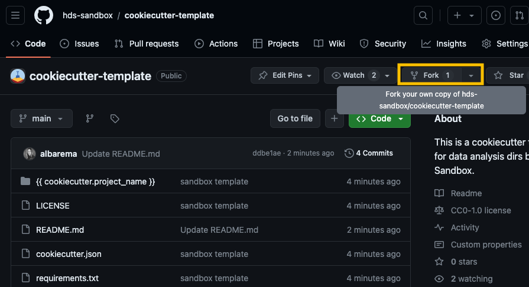
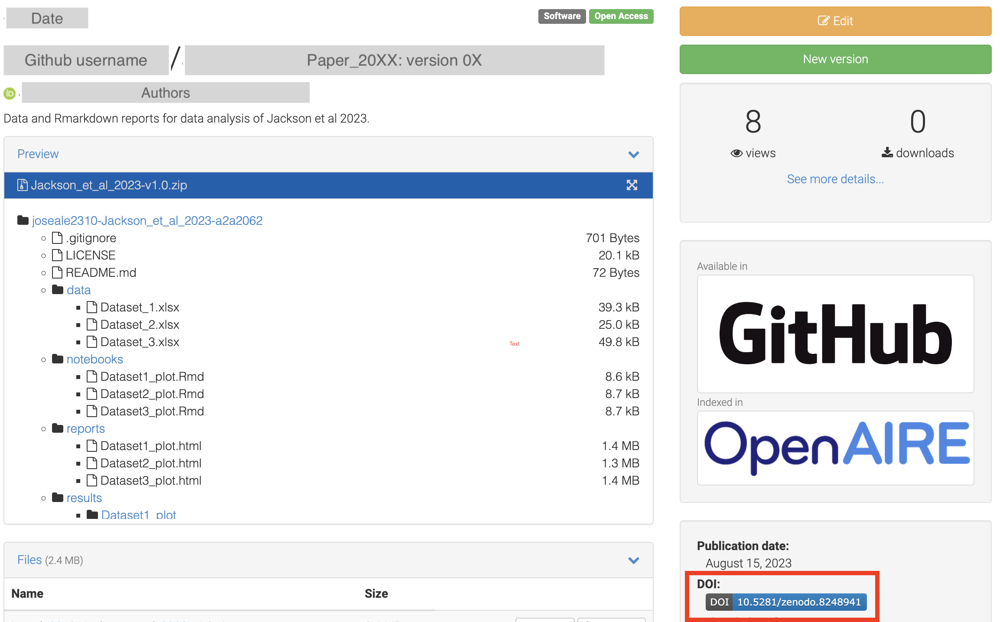

# DTU workshop October 2023

**Last updated:** *{{ git_revision_date_localized }}*

!!! note "Section Overview"

    &#128368; **Time Estimation:** 75 minutes  

    &#128172; **Learning Objectives:**    
        
    1. Organize and structure your data and data analysis with cookiecutter templates
    2. Establish metadata fields and collect metadata when creating a cookiecutter folder
    3. Establish naming conventions for your data
    4. Make a catalog of your data
    5. Create GitHub repositories of your data analysis and display them as GitHub Pages
    6. Archive GitHub repositories on Zenodo

This is a practical version of the full RDM on NGS data workshop. The main key points of the exercises shown here is to help you organize and structure your NGS datasets and your data analyses. We will see how to keep track of your experiments metadata and how to safely version control and archive your data analyses using GitHub repositories and Zenodo. We hope that through these practical exercises and step-by-step guidance, you'll gain valuable skills in efficiently managing and sharing your research data, enhancing the reproducibility and impact of your work.

!!! warning "Requirements"

    In order to follow this tutorial you will need:
    
    - A [GitHub account](https://github.com/) and git installed in your computer.
    - A [Zenodo account](https://zenodo.org/)
    - [Python](https://www.python.org/) and [pip](https://pip.pypa.io/en/stable/installation/) installed
    - [MkDocs](https://www.mkdocs.org/) and [MkDocs material](https://squidfunk.github.io/mkdocs-material/) theme (can be installed through pip)
    - [Cookicutter](https://cookiecutter.readthedocs.io/en/stable/) (can be installed through pip)

    In addition, you should install the following MkDocs extensions

    ```bash
    pip install mkdocs
    pip install mkdocs-material
    pip install mkdocs-minify-plugin
    pip install mkdocs-git-revision-date-localized-plugin 
    pip install mkdocs-jupyter
    pip install mkdocs-table-reader-plugin
    ```

## 1. Organize and structure your NGS data and data analysis

Applying a consistent file structure and naming conventions to your files will help you to efficiently manage your data. We will divide your NGS data and data analyses into two different types of folders:

1. **Assay folders**: These folders contain the **raw and processed NGS datasets**, as well as the **pipeline/workflow** used to generate the processed data, provenance of the raw data and quality control reports of the data. This data should be **locked and read-only** to prevent unwanted modifications.
2. **Project folders**: These folders contain **all the necessary files for a specific research project**. A project may use several assays or results from other projects. The assay data should not be copied or duplicated, but linked from the original source.

Projects and Assays are separated from each other because a project may use one or more assays to answer a scientific question, and assays may be reused several times in different projects. This could be, for example, all the data analysis related to a publication (a RNAseq and a ChIPseq experiment), or a comparison between a previous ATACseq experiment (which was used for a older project) with a new laboratory protocol.

You could also create **Genomic resources folders** such things such as genome references (fasta files) and annotations (gtf files) for different species, as well as indexes for different alignment algorithms. If you want to know more, feel free to check the relevant [full lesson](./06_file_structure.md#genomic-resources-folder)

This will help you to keep your data tidied up, specially if you are working on a big lab where assays may be used for different purposes and different people!

### Assay folder

For each NGS experiment there should be an `Assay` folder that will contain all experimental datasets, that is, an `Assay` (raw files and pipeline processed files). Raw files should not be modified at all, but you should probably lock modifications to the final results once you are done with preprocessing the data. This will help you prevent unwanted modifications to the data. Each `Assay` subfolder should be named in a way that it is unique, easily readable, distinguishable and understood at a glance. For example, you could name an NGS assay using an acronym for the type of NGS assay (RNAseq, ChIPseq, ATACseq), a keyword that represents a unique descriptive element of that assay, and the date. Like this:

```
<Assay-ID>_<keyword>_YYYYMMDD
```

For example `CHIP_Oct4_20230101` is a ChIPseq assay made on 1st January 2023 with the keyword Oct4, so it is easily identifiable by eye. Next, let's take a look at a possible folder structure and what kind of files you can find there.

```bash
CHIP_Oct4_20230101/
├── README.md
├── metadata.yml
├── pipeline.md
├── processed
└── raw
   ├── .fastq.gz
   └── samplesheet.csv
```

- **README.md**: Long description of the assay in markdown format. It should contain provenance of the raw NGS data (samples, laboratory protocols used, aim of the assay, etc)
- **metadata.yml**: metadata file for the assay describing different keys and important information regarding that assay ([see this lesson](./07_metadata.md)).
- **pipeline.md**: description of the pipeline used to process raw data, as well as the commands used to run the pipeline.
- **processed**: folder with results of the preprocessing pipeline. Contents depend on the pipeline used.
- **raw**: folder with the raw data.
    - *.fastq.gz*:In the case of NGS assays, there should be fastq files.
    - *samplesheet.csv*: file that contains metadata information for the samples. This file is used to run the nf-core pipelines. You can also add extra columns with info regarding the experimental variables and batches so it can be used for downstream analysis as well.

### Project folder

On the other hand, we have the other type of folder called `Projects`. In this folder you will save a **subfolder for each project** that you (or your lab) works on. Each `Project` subfolder will contain project information and all the data analysis notebooks and scripts used in that project.

As like for an Assay folder, the Project folder should be named in a way that it is unique, easily readable, distinguishable and understood at a glance. For example, you could name it after the main author initials, a keyword that represents a unique descriptive element of that assay, and the date:

```bash
<author_initials>_<keyword>_YYYYMMDD
```

For example, `JARH_Oct4_20230101`, is a project about the gene Oct4 owned by Jose Alejandro Romero Herrera, created on the 1st of January of 2023.

Next, let's take a look at a possible folder structure and what kind of files you can find there.

```bash
<author_initials>_<keyword>_YYYYMMDD
├── data
│  └── <Assay-ID>_<keyword>_YYYYMMDD/
├── documents
│  └── Non-sensitive_NGS_research_project_template.docx
├── notebooks
│  └── 01_data_analysis.rmd
├── README.md
├── reports
│  ├── figures
│  │  └── 01_data_analysis/
│  │   └── heatmap_sampleCor_20230102.png
│  └── 01_data_analysis.html
├── requirements.txt
├── results
│  └── 01_data_analysis/
│      └── DEA_treat-control_LFC1_p01.tsv
├── scripts
└── metadata.yml
```

- **data**: folder that contains symlinks or shortcuts to where the data is, avoiding copying and modification of original files.
- **documents**: folder containing word documents, slides or pdfs related to the project, such as explanations of the data or project, papers, etc. It also contains your [Data Management Plan](./05_DMP.md).
    - *Non-sensitive_NGS_research_project_template.docx*. This is a pre-filled Data Management Plan based on the Horizon Europe guidelines.
- **notebooks**: folder containing Jupyter, R markdown or Quarto notebooks with the actual data analysis.
- **README.md**: detailed description of the project in markdown format.
- **reports**: notebooks rendered as html/docx/pdf versions, ideal for sharing with colleagues and also as a formal report of the data analysis procedure.
    - *figures*: figures produced upon rendering notebooks. The figures will be saved under a subfolder named after the notebook that created them. This is for provenance purposes so we know which notebook created which figures.
- **requirements.txt**: file explaining what software and libraries/packages and their versions are necessary to reproduce the code.
- **results**: results from the data analysis, such as tables with differentially expressed genes, enrichment results, etc.
- **scripts**: folder containing helper scripts needed to run data analysis or reproduce the work of the folder
- **description.yml**: short description of the project.
- **metadata.yml**: metadata file for the assay describing different keys ([see this lesson](./07_metadata.md)).

### Template engine

It is very easy to create a folder template using [cookiecutter](https://github.com/cookiecutter/cookiecutter). Cookiecutter is a command-line utility that creates projects from cookiecutters (that is, a template), e.g. creating a Python package project from a Python package project template. Here you can find an example of a cookiecutter folder template directed to [NGS data](https://github.com/brickmanlab/ngs-template), where we have applied the structures explained in the previous sections. You are very welcome to adapt it or modify it to your needs!

#### Quick tutorial on cookiecutter

Creating a Cookiecutter template from scratch involves defining a folder structure, creating a `cookiecutter.json` file, and specifying the placeholders (keywords) that will be replaced during project generation. Let's walk through the process step by step:

##### Step 1: Create a Folder Template

Start by creating a folder with the structure you want for your template. For example, let's create a simple Python project template:

```plaintext
my_template/
|-- {{cookiecutter.project_name}}
|   |-- main.py
|-- tests
|   |-- test_{{cookiecutter.project_name}}.py
|-- README.md
```

In this example, `{{cookiecutter.project_name}}` is a placeholder that will be replaced with the actual project name when the template is used.

##### Step 2: Create `cookiecutter.json`

In the root of your template folder, create a file named `cookiecutter.json`. This file will define the variables (keywords) that users will be prompted to fill in. For our Python project template, it might look like this:

```json
{
  "project_name": "MyProject",
  "author_name": "Your Name",
  "description": "A short description of your project"
}
```

These are the questions users will be asked when generating a project based on your template. The values provided here will be used to replace the corresponding placeholders in the template files.

In addition to replacing placeholders in file and directory names, Cookiecutter can also automatically fill in information within the contents of text files. This can be useful for providing default configurations or templates for code files. Let's extend our previous example to include a placeholder inside a text file:

Certainly! In addition to replacing placeholders in file and directory names, Cookiecutter can also automatically fill in information within the contents of text files. This can be useful for providing default configurations or templates for code files. Let's extend our previous example to include a placeholder inside a text file:

Modify the `my_template/main.py` file to include a placeholder inside its contents:

```python
# main.py

def hello():
    print("Hello, {{cookiecutter.project_name}}!")
```

Now, the `{{cookiecutter.project_name}}` placeholder is inside the `main.py` file. When you run Cookiecutter, it will automatically replace the placeholders not only in file and directory names but also within the contents of text files. After running Cookiecutter, your generated `main.py` file might look like this:

```python
# main.py

def hello():
    print("Hello, MyProject!")  # Assuming "MyProject" was entered as the project_name
```

##### Step 3: Use Cookiecutter

Now that your template is set up, you can use Cookiecutter to generate a project based on it. Open a terminal and run:

```bash
cookiecutter path/to/your/template
```

Cookiecutter will prompt you to fill in the values for `project_name`, `author_name`, and `description`. After you provide these values, Cookiecutter will replace the placeholders in your template files with the entered values.

##### Step 4: Explore the Generated Project

Once the generation process is complete, navigate to the directory where Cookiecutter created the new project. You will see a project structure with the placeholders replaced by the values you provided.

!!! question "Exercise 1: Create your own template"

    Using cookiecutter, create your own templates for your folders. You do not need to copy exactly our suggestions, adjust your template to your own needs!

    We have prepared already two simple cookiecutter templates in GitHub repositories.

    **Assay**

    1. First, fork our [Assay folder template](https://github.com/hds-sandbox/assay-template) from the GitHub page into your own account/organization.
    
    2. Then, use `git clone <your URL to the template>` to put it in your computer.
    3. Modify the contents of the repository so that it matches the **Assay** example above. You are welcome to do changes as you please!
    4. Modify the `cookiecutter.json` file so that it will include the **Assay** name template
    5. Git add, commit and push your changes
    6. Test your folder by using `cookiecutter <URL to your GitHub repository for "assay-template>`
    
    **Project**
    
    7. First, fork our [Project folder template](https://github.com/hds-sandbox/project-template) from the GitHub page into your own account/organization.
    
    8. Then, use `git clone <your URL to the template>` to put it in your computer.
    9.  Modify the contents of the repository so that it matches the **Project** example above. You are welcome to do changes as you please!
    10. Modify the `cookiecutter.json` file so that it will include the **Project** name template
    11. Git add, commit and push your changes
    12. Test your folder by using `cookiecutter <URL to your GitHub repository for "project-template>`

## 2. Metadata and naming conventions

Metadata is the behind-the-scenes information that makes sense of data and gives context and structure. For NGS data, metadata includes information such as when and where the data was collected, what it represents, and how it was processed. Let's check what kind of relevant metadata is available for NGS data and how to capture it in your Assay or Project folders. Both of these folders contain a metadata.yml file and a README.md file. In this section, we will check what kind of information you should collect in each of these files.

!!! warning "Metadata and controlled vocabularies"

    In order for metadata to be most useful, you should try to use controlled vocabularies for all your fields. For example, tissue could be described with the [UBERON ontologies](https://www.ebi.ac.uk/ols/ontologies/uberon), species using the [NCBI taxonomy](https://www.ncbi.nlm.nih.gov/taxonomy), diseases using the [Mondo database](https://mondo.monarchinitiative.org/), etc. Unfortunately, implementing a systematic way of using these vocabularies is rather complex and outside the scope of this workshop, but you are very welcome to try to implement them on your own!

### README.md file

The README.md file is a [markdown file](https://www.markdownguide.org/) that allows you to write a long description of the data placed in a folder. Since it is a markdown file, you are able to write in rich text format (bold, italic, include links, etc) what is inside the folder, why it was created/collected, how and when. If it is an `Assay` folder, you could include the laboratory protocol used to generate the samples, images explaining the experiment design, a summary of the results of the experiment and any sort of comments that would help to understand the context of the experiment. On the other hand, a 'Project' README file may contain a description of the project, what are its aims, why is it important, what 'Assays' is it using, how to interpret the code notebooks, a summary of the results and, again, any sort of comments that would help to understand the project.

Here is an example of a README file for a `Project`` folder:

```
# NGS Analysis Project: Exploring Gene Expression in Human Tissues

## Aims

This project aims to investigate gene expression patterns across various human tissues using Next Generation Sequencing (NGS) data. By analyzing the transcriptomes of different tissues, we seek to uncover tissue-specific gene expression profiles and identify potential markers associated with specific biological functions or diseases.

## Why It's Important

Understanding tissue-specific gene expression is crucial for deciphering the molecular basis of health and disease. Identifying genes that are uniquely expressed in certain tissues can provide insights into tissue function, development, and potential therapeutic targets. This project contributes to our broader understanding of human biology and has implications for personalized medicine and disease research.

## Datasets

We have used internal datasets with IDs: RNA_humanSkin_20201030, RNA_humanBrain_20210102, RNA_humanLung_20220304.

In addition, we utilized publicly available NGS datasets from the GTEx (Genotype-Tissue Expression) project, which provides comprehensive RNA-seq data across multiple human tissues. These datasets offer a wealth of information on gene expression levels and isoform variations across diverse tissues, making them ideal for our analysis.

## Summary of Results

Our analysis revealed distinct gene expression patterns among different human tissues. We identified tissue-specific genes enriched in brain tissues, highlighting their potential roles in neurodevelopment and function. Additionally, we found a set of genes that exhibit consistent expression across a range of tissues, suggesting their fundamental importance in basic cellular processes.

Furthermore, our differential expression analysis unveiled significant changes in gene expression between healthy and diseased tissues, shedding light on potential molecular factors underlying various diseases. Overall, this project underscores the power of NGS data in unraveling intricate gene expression networks and their implications for human health.

---

For more details, refer to our [Jupyter Notebook](link-to-jupyter-notebook.ipynb) for the complete analysis pipeline and code.
```

### metadata.yml

The metadata file is a [yml file](https://fileinfo.com/extension/yml), which is a text document that contains data formatted using a human-readable data format for data serialization.


### Metadata fields

There is a ton of information you can collect regarding an NGS assay or a project. Some information fields are very general, such as author or date, while others are specific to the Assay or Project folder. Below, we will take a look at minimal information you should collect in each of the folders.

#### General metadata fields

Here you can find a list of suggestions for general metadata fields that can be used for both assays and project folders:

- **Title**: A brief yet informative name for the dataset.
- **Author(s)**: The individual(s) or organization responsible for creating the dataset. You can use your [ORCID](https://orcid.org/)
- **Date Created**: The date when the dataset was originally generated or compiled. Use YYYY-MM-DD format!
- **Description**: A short narrative explaining the content, purpose, and context.
- **Keywords**: A set of descriptive terms or phrases that capture the folder's main topics and attributes.
- **Version**: The version number or identifier for the folder, useful for tracking changes.
- **License**: The type of license or terms of use associated with the dataset/project.

#### Assay metadata fields

Here you will find a table with possible metadata fields that you can use to annotate and track your `Assay` folders:

{{ read_table('./assets/assay_metadata.tsv') }}

#### Project metadata fields

Here you will find a table with possible metadata fields that you can use to annotate and track your `Project` folders:

{{ read_table('./assets/project_metadata.tsv') }}

### More info

The information provided in this lesson is not at all exhaustive. There might be many more fields and controlled vocabularies that could be useful for your NGS data. We recommend that you take a look at the following sources for more information!

- [Transcriptomics metadata standards and fields](https://faircookbook.elixir-europe.org/content/recipes/interoperability/transcriptomics-metadata.html#analysis-metadata)
- [Bionty](https://lamin.ai/docs/bionty): Biological ontologies for data scientists.

!!! question "Exercise 2: modify the metadata.yml files in your cookiecutter templates"

    We have seen some examples of metadata for NGS data. It is time now to customize your cookiecutter templates and modify the metadata.yml files so that they fit your needs! 
    
    1. Think about what kind of metadata you would like to include.
    2. Modify the `cookiecutter.json` file so that when you create a new folder template, all the metadata is filled accordingly.
    
    3. Modify the `metadata.yml` file so that it includes the metadata recorded by the `cookiecutter.json` file.
    
    4. Modify the `README.md` file so that it includes the short description recorded by the `cookiecutter.json` file.
    5. Git add, commit and push the changes of your template.
    6. Test your folders by using the command `cookiecutter <URL to your cookiecutter repository in GitHub>`

## 3. Naming conventions

Using consistent naming conventions is important in scientific research as it helps with the organization and retrieval of data or results. By adopting standardized naming conventions, researchers ensure that files, experiments, or data sets are labeled in a clear, logical manner. This makes it easier to locate and compare similar types of data or results, even when dealing with large datasets or multiple experiments. For instance, in genomics, employing uniform naming conventions for files related to specific experiments or samples allows for swift identification and comparison of relevant data, streamlining the research process and contributing to the reproducibility of findings. This practice promotes efficiency, collaboration, and the integrity of scientific work.

### General tips

Below you will find a small list of general tips to follow when you name a folder or a file:

- Use only alphanumeric characters to write a word: a to z and 0 to 9
- Avoid special characters: ~!@#$%^&*()`[]{}"|
- Date format: use `YYYYMMDD` format. For example: 20230101.
- Authors: use initials. For example: JARH
- **Don't use of spaces**! Computers get very confused when you need to point a path to a file and it contains spaces! Instead:
    - Separate field sections are separated by underscores `_`.
    - Words in each section are written in [camelCase](https://en.wikipedia.org/wiki/Camel_case).
  It would look then like this: `field1_word1Word2.txt`. For example: `heatmap_sampleCor_20230101.png`. The first field indicates what this file is, i.e., a heatmap. Second field is what is being plotted, i.e, sample correlations; since the field contains two words, they are written in camelCase. The third field is the date of when the image was created.
- Use as short fields as possible. You can try to use understandable abbreviations, like LFC for LogFoldChange, Cor for correlations, Dist for distances, etc.
- Avoid long names as much as you can, be concise!
- Avoid creating many sublevels of folders.
- Write down your naming convention pattern and document it in the README file
- When using a sequential numbering system, use leading zeros to make sure files sort in sequential order. Using `01` instead of just `1` if your sequence only goes up to `99`.
- Versions should be used as the last element, and use at least two digits with a leading 0 (e.g. v01, v02)

### Suggestions for NGS data

More info on naming conventions for different types of files and analysis is in development.

{{ read_table('./assets/file_naming_convention.tsv') }}

!!! question "Exercise 3: Create your own naming conventions"

    Think about the most common types of files and folders you will be working on, such as visualizations, results tables, processed files, etc. Then come up with a logical and clear way of naming those files using the tips suggested above. Remember to avoid making long and complicated names!

## 4. Create a catalog of your assays folder

The next step is to collect all the NGS datasets that you have created in the manner explained above. Since your folders all should contain the `metadata.yml` file in the same place with the same metadata, it should be very easy to iteratively go through all the folders and merge all the metadata.yml files into a one single table. This table can be then browsed easily with Microsoft Excel, for example. If you are interested in making a Shiny app or Python Panel tool to interactively browse the catalog, check out this [lesson](./08_database.md).

!!! question "Exercise 4: create a metadata.tsv catalog"

    We will make a small script in R (or you can make one with python) that recursively goes through all the folders inside a input path (like your `Assays` folder), fetch all the `metadata.yml` files and merge them. Finally, it will write a tsv file as an output. 

    1. Create a folder call `Assays`
    2. Under that folder, make three new `Assay` folders from your cookiecutter template
    3. Run the script below with R (or create your own with python). Modify the `folder_path` variable so it matches the path tot the folder `Assays`. The table will be written under the same `folder_path`.
    4. Visualize your `Assays` table with Excel

    ```R
    library(yaml)
    library(dplyr)
    library(lubridate)

    # Function to recursively fetch metadata.yml files
    get_metadata <- function(folder_path) {
        file_list <- list.files(path = folder_path, pattern = "metadata\\.yml$", recursive = TRUE, full.names = TRUE)
        metadata_list <- lapply(file_list, yaml::yaml.load_file)
        return(metadata_list)
        }

    # Specify the folder path
    folder_path <- "/path/to/your/folder"

    # Fetch metadata from the specified folder
    metadata <- get_metadata(folder_path)

    # Convert metadata to a data frame
    metadata_df <- data.frame(matrix(unlist(metadata), ncol = length(metadata), byrow = TRUE))
    colnames(metadata_df) <- names(metadata[[1]])

    # Save the data frame as a TSV file
    output_file <- paste0("database_", format(Sys.Date(), "%Y%m%d"), ".tsv")
    write.table(metadata_df, file = output_file, sep = "\t", quote = FALSE, row.names = FALSE)

    # Print confirmation message
    cat("Database saved as", output_file, "\n")
    ```

## 5. Version control of your data analysis using Git and Github

Version control is a systematic approach to tracking changes made to a project over time. It provides a structured means of documenting alterations, allowing you to revisit and understand the evolution of your work. In research data management and data analytics, version control is very important and gives you a lot of advantages.

[Git](https://git-scm.com/about) is a distributed version control system that enables developers and researchers to efficiently manage their project's history, collaborate seamlessly, and ensure data integrity. At its core, Git operates through the following principles and mechanisms:
On the other hand, [GitHub](https://github.com/) is a web-based platform that enhances Git's capabilities by providing a collaborative and centralized hub for hosting Git repositories. It offers several key functionalities, such as tracking issues, security features to safeguard your repos, and GitHub Pages that allows you to create websites to showcase your projects.

!!! tip "Create a GitHub organization for your lab or department"

    GitHub allows users to create organizations and teams that will collaborate together or create repositories under the same umbrella organization. If you would like to create an educational organization in GitHub, you can do so for free! For example, you could create a GitHub account for your lab.

    In order to create a GitHub organization, follow these [instructions](https://docs.github.com/en/organizations/collaborating-with-groups-in-organizations/creating-a-new-organization-from-scratch)

    After you have created the GitHub organization, make sure that you create your repositories under the organization space and not your own user!

### Creating a git repo online and copying your project folder

Version controlling your data analysis folders, a.k.a. `Project` folder, is very easy once you have set up your cookiecutter templates. The simplest way of doing this is to first create a remote GitHub repository from the webpage (or from the Desktop app, if you are using it) with a proper project name. Then `git clone` that repository you just made into your `Projects` main folder. Then, use cookiecutter to create a project folder template and copy-paste the contents of the folder template to your cloned repo. If you wish, you could already git add, commit and push the first changes to the folders and continue from there on.

!!! tip "Tips to write good commit messages"

    If you would like to know more about Git commits and the best way to make clear git messages, check out [this post](https://www.conventionalcommits.org/en/v1.0.0/)!

### GitHub Pages

Once you have created your repository (and put it in GitHub), you have now the opportunity to add your data analysis reports that you created, in either Jupyter Notebooks, Rmarkdowns or html reports, in a [GitHub Page website](https://pages.github.com/). Creating a GitHub page is very simple, and we really recommend that you follow the nice tutorial that GitHub as put for you. Nonetheless, we will see the main steps in the exercise below.

There are many different ways to create your webpages. We recommend using Mkdocs and Mkdocs materials as a framework to create a nice webpage in a simple manner. The folder templates that we used as an example in the previous exercise already contain everything you need to start a webpage. Nonetheless, you will need to understand the basics of [MkDocs](https://www.mkdocs.org/) and [MkDocs materials](https://squidfunk.github.io/mkdocs-material/) to design a webpage to your liking. MkDocs is a static webpage generator that is very easy to use, while MkDocs materials is an extension of the tool that gives you many more options to customize your website. Check out their webpages to get started!

!!! question "Exercise 5: make a project folder and publish a data analysis webpage"

    1. Configure your main GitHub Page and its repo

    The first step is to set up the main GitHub Page site and the repository that will host it. This is very simple, as you will only need to follow [these steps](https://pages.github.com/).
    After you have created the *organization/username*github.io, it is time to configure your `Project` repository webpage using MkDocs!

    2. Start a new project from cookiecutter or use one from the previous exercise.

    If you use a `Project` repo from the first exercise, go to the next paragraph. Using cookiecutter, create a new data analysis project. Remember to fill up your metadata and description files! After you have created the folder, it would be best to initialize a Git repo following the instructions from the [previous section](#creating-a-git-repo-online-and-copying-your-project-folder).

    Next, link your data of interest (or create a small fake dataset) and make an example of data analysis notebook/report (this could be just a scatter plot of a random matrix of values). Depending on your setup, you might be using Jupyter Notebooks or Rmarkdowns. The extensions that we have installed using `pip` allows you to directly add a Jupyter Notebook file to the `mkdocs.yml` navigation section. On the other hand, if you are using Rmarkdown, you will have to knit your document into either an html page or a github document.
    
    For the purposes of this exercise, we have already included a basic `index.md` markdown file that can serve as the intro page of your repo, and a `jupyter_example.ipynb` with some code in it. You are welcome to modify them further to test them out!

    3. Use MkDocs to create your webpage

    When you are happy with your files and are ready too publish them, make sure to add, commit and push the changes to the remote. Then, build up your webpage using MkDocs and the [`mkdocs gh-deploy`](https://www.mkdocs.org/user-guide/deploying-your-docs/) command from the same directory where the `mkdocs.yml` file is. For example, if your `mkdocs.yml` for your `Project` folder is in `/Users/JARH/Projects/project1_JARH_20231010/mkdocs.yml`, do `cd /Users/JARH/Projects/project1_JARH_20231010/` and then `mkdocs gh-deploy`.

    Finally, we only need to set up the GitHub `Project` repo settings.

    4. Publishing your GitHub Page
    
    Go to your GitHub repo settings and configure the Page section. Since you are using the `mkdocs gh-deploy` command to publish your site in the `gh-pages` branch (as explained the the mkdocs documentation), we need to change where GitHub is fetching the website from:

    

    - Branch should be `gh-pages`
    - Folder should be `root`

    After a couple of minutes, your webpage should be ready!

## 6. Archive GitHub repositories on Zenodo

Archives are dedicated digital platforms designed for the secure storage, curation, and dissemination of scientific data. These repositories hold great importance in the research community as they serve as reliable archives for preserving valuable datasets. Their standardized formats and robust curation processes ensure the long-term accessibility and citability of research findings. Researchers worldwide rely on these repositories to share, discover, and validate scientific information, thereby fostering transparency, collaboration, and the advancement of knowledge across various domains of study.

The next practical exercise will be to archive your `Project` folder that contains the data analyses performed on your NGS data in a repository like Zenodo. We can do this by linking your Zenodo account to your GitHub account.

!!! warning "Archiving your NGS data"

    In this practical lesson, we will only archive our data analyses in the `Project` folders. Your actual NGS data should be deposited in a domain-specific archive such as [Gene Expression Omnibus (GEO)](https://www.ncbi.nlm.nih.gov/geo/) or [Annotare](https://www.ebi.ac.uk/fg/annotare/login/). If you want to know more about these archives, check out this [lesson](./10_repos.md)

### Zenodo

Zenodo[https://zenodo.org/] is an open-access digital repository designed to facilitate the archiving of scientific research outputs. It operates under the umbrella of the European Organization for Nuclear Research (CERN) and is supported by the European Commission. Zenodo accommodates a broad spectrum of research outputs, including datasets, papers, software, and multimedia files. This versatility makes it an invaluable resource for researchers across a wide array of domains, promoting transparency, collaboration, and the advancement of knowledge on a global scale.

Operating on a user-friendly web platform, Zenodo allows researchers to easily upload, share, and preserve their research data and related materials. Upon deposit, each item is assigned a unique Digital Object Identifier (DOI), granting it a citable status and ensuring its long-term accessibility. Additionally, Zenodo provides robust metadata capabilities, enabling researchers to enrich their submissions with detailed contextual information. In addition, it allows you to [link you GitHub account](https://docs.github.com/en/repositories/archiving-a-github-repository/referencing-and-citing-content), providing a streamlined way to archive a specific release of your GitHub repository directly into Zenodo. This integration simplifies the process of preserving a snapshot of your project's progress for long-term accessibility and citation.

!!! question "Exercise 6: Archive a `Project` GitHub repo in Zenodo"

    1. In order to archive your GitHub repos in Zenodo, you will first need to [link your Zenodo and GitHub accounts](https://docs.github.com/en/repositories/archiving-a-github-repository/referencing-and-citing-content).
    2. Once your accounts are linked, go to your Zenodo GitHub account settings and turn on the GitHub repository you want to archive.
    
    3. Creating a Zenodo archive is now as simple as [making a release](https://docs.github.com/en/repositories/releasing-projects-on-github/managing-releases-in-a-repository) in your GitHub repository. Remember to make a proper tag! **NOTE: If you make a release before enabling the GitHub repository in Zenodo, it will not appear in Zenodo!**
    
    4. Zenodo will automatically detect the release and it should appear in your Zenodo upload page.
    
    5. This archive is assigned a unique Digital Object Identifier (DOI), making it a citable reference for your work.
    

    Before submitting your work in a journal, make sure to link your data analysis repository to [Zenodo](https://zenodo.org/), get a DOI and cite it in your manuscript!

## Wrap up

In this small workshop we have learned how improve the FAIRability of your data, as well as organizing and structuring it in a way that will be much more useful in the future. This advantages do not serve yourself only, but your teammates, group leader and the general scientific population! We hope that you found this workshop useful. If you would like to leave us some comments or suggestions, feel free to answer this form!

[**FEEDBACK FORM**](https://forms.office.com/e/BZkpzDKL0L)
