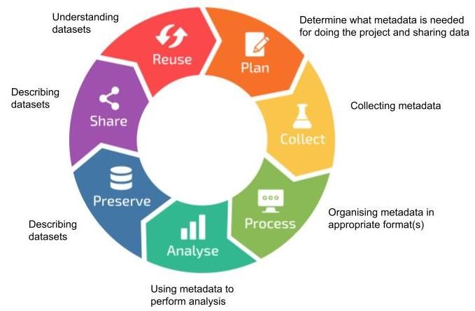
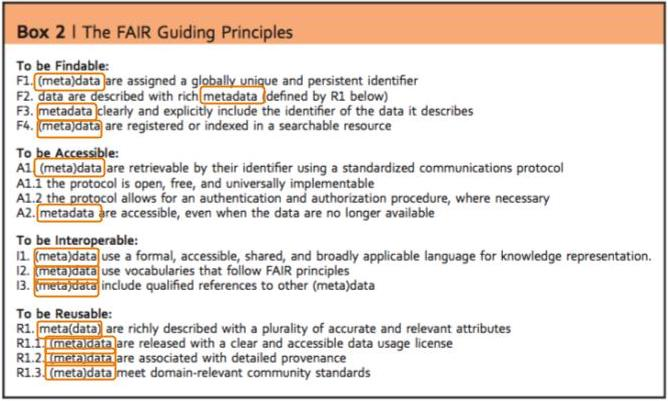

To understand how the data you produce has been generated, it is important to document descriptions of this, so that you, your collaborators, and someone else can understand it later on. Actually, you yourself is the most likely recipient of this information, because “it is the doom of men that they forget”, as someone said.

This - “the data about the data (or anything really)” - is what we call metadata. However, it might not always be straightforward to draw a line between data and metadata. It depends on the particular research interest and focus of the person looking at the data and metadata. “One persons metadata, is another persons data”

Some of this information might describe the particulars of a whole study. Some of it will describe detailed particulars of the different components of a study or experiment. Such as, for example:

- File types and formats of the data
- Methodology for data collection
- Analytical and procedural information
- Sources of samples
- Sample treatment
- Geolocation(s) of samples
- Licence for re-use of the data

Metadata is used and/or generated throughout the whole of the research data life cycle. From the planning stage when you decide on the (meta)data you need to perform the project, over collecting, organising, and using it for analysis, to describing the data for preservation and sharing, and for understanding published datasets for reuse.

*[RDM life cycle, by ELIXIR RDMkit](https://rdmkit.elixir-europe.org/images/data_life_cycle.png)*

Metadata are absolutely central to the FAIR principles. Data can not be FAIR without good metadata.

*from Wilkinson, Mark et al. “The FAIR Guiding Principles for scientific data management and stewardship”. Scientific Data 3, Article number: 160018 (2016) [http://dx.doi.org/10.1038/sdata.2016.18](http://dx.doi.org/10.1038/sdata.2016.18)*

> ## Challenge
>
> If you have not done so already, create a folder on your computer for the course
>
> Download the example datafile [samples_metadata_lesson.csv](../files/samples_metadata_lesson.csv), and save it in the folder for the course on your computer.
>
> - This is a so called CSV (Comma Separated Values) file. A CSV file is a text file that contains tabular data, where the content for different columns is separated by commas (,) and often enclosed by quotes (' or “).
> - CSV files can be opened by text editor programs, as well as by spreadsheet programs such as e.g. Microsoft Excel, LibreOffice Calc, or Google Spreadsheet. Viewing the content of a CSV file will in many cases be easier in a spreadsheet program than in a text editor.
>
> Open the samples_metadata_lesson.csv file in a program of choice.
>
> - The first line of the file contains the headers for the different columns. The rest of the lines contain information about a number of samples from a study.
>
> Look at the content of the file and discuss with your neighbour
>
> - What are some of the problems you see with the descriptions of the samples?
>
{: .challenge}

To be properly useful, the metadata should be understandable over time - for you and others. And to follow the FAIR principles, _others_ means computer programs as well as humans. You also need to be consistent when describing metadata, e.g. do not mix different date formats, or use synonyms for the same phenomena.

How much metadata should you document? You can look at this at different levels. The minimal level is the metadata necessary for you to do your particular analysis. A further level is the metadata necessary for someone to understand the data. Going further, documenting all the metadata you have might allow future analysis (by you or others) outside of the scope of your original study. A good principle can be “how can I make this dataset as useful as possible for others?”. We will discuss this more in the Metadata standards part of this module.
