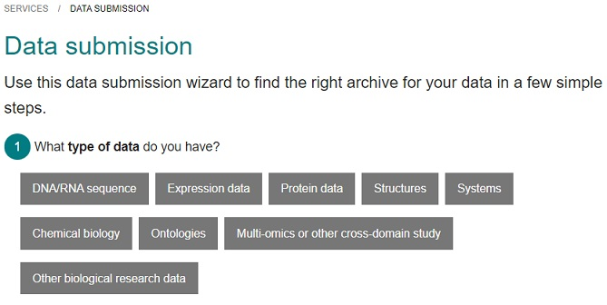

## What are research data repositories?
Traditionally 'all' research outputs were put in the published article only, resulting in that the findings often where difficult to reproduce let alone reuse, or put in a local web server with limited longevity. Fortunately times are changing and nowadays there is a pletora of repositories to choose between, in order to make research as easy and widely available as possible.

## Why submit your datasets to a repository?
Why should you care? Submitting your data to a repository likely takes a lot of time, time you could spend on doing research, and employers as well as funders are only interested in how many articles you have published, not how many datasets you have published. Well, times are indeed changing, there are many institutions with data policies on sharing, and funders want maximum value for their invested money. Besides, if *you* do not share your data, you cannot ask of others to share either, it's as simple as that. You could argue that you do share your data if someone asks for it (aka the (in)famous phrase 'available upon request') but repositories provides the technical solution to FAIR data:

* **Findable** by being assigned a persistent identifier, and by being described with rich metadata.
* **Accessible** by being put in a resource that is searchable, and enables easy access via internet
* **Interoperable** by using standard format and language to represent both the data and its metadata
* **Reusable** by fulfilling the F, A, and I, and by having a clear and accessible data usage license 

Hence, by submitting data to a repository, your data becomes FAIR and you do not have to provide a solution on your own.

Reasons for sharing in a repository:

* Open Science & FAIR - To meet the requirements from funders and society on Open Science & FAIR
* Reproducibility - So that your published research results can be reproduced
* Trail of evidence - To provide a provenance of the data
* Reusability / 3rd party access - To give others easy access to your data
* Archival purposes - Research data should be available for as long as it is useful to someone
* Publication of paper requires it - Nowadays most publishers require you to submit the data to a repository when publishing a paper

## What research outputs should be submitted?
Apart from the data itself, everything necessary to understand, reproduce and reuse the data should be submitted to a repository:
* Raw data: this is the data that comes straight from the instrument, e.g. RNA sequences in fastq format
* Processed & analysed data: this is the data where some type of analysis or processing has been done, e.g. normalization, removal of outliers, expression measurements, statistics, annotation
* Metadata: this is the description of the raw and processed data, e.g. in the form of minimum information to reproduce the data, sample information, precise protocols, analysis scripts and code, etc

## How do I find a suitable repository?

As mentioned, there is now a pletora of repositories, with varying reach (impact) and depth (rich metadata descriptions), and they are often divided into three categories: domain-specific, general purpose, and in-house/institutional.

### Domain-specific repositories 
This type of repository focuses on specific data types and is typically the best choice if you can find one that is suitable for your research data. It will reach your research community, so that others working in your field can find and reuse your data, and incorporates metadata standards in order to make the data as widely useful as possible. The repositories usually have long-term sustainability plan, i.e. they will be available for a long time, and are typically free of charge.

Examples: 
* [European Nucleotide Archive](https://www.ebi.ac.uk/ena/browser/home) (ENA) - for genomic sequence data (non-human)
* [European Genome Phenome Archive](https://ega-archive.org/) (EGA) - for human genomic sequence data
* [ArrayExpress](https://www.ebi.ac.uk/arrayexpress) - for gene expression data
* [PRIDE](http://www.ebi.ac.uk/pride) - for proteomics data

There are several ways to find domain-specific repositories within life science:
* [EBI repository wizard](https://www.ebi.ac.uk/submission/) - guide depending on data type
* [ELIXIR deposition databases](https://elixir-europe.org/platforms/data/elixir-deposition-databases) - core resources with long-term data preservation and accessibility plans
* [FAIRsharing.org/databases](https://fairsharing.org/databases/) - catalogue of many repositories, with possibility to filter on e.g. domain
* [Scientific Data Repository Guidance](https://www.nature.com/sdata/policies/repositories#life) - publisher’s recommendation
* [re3data.org](https://www.re3data.org/) - registry of research data repositories (not only life science)

> ## Repository metadata
> The metadata you collect during your project will end up in the repository, hence finding a suitable repository already while planning the project may help you decide on which metadata to collect.
{: .callout}

### General purpose repositories 
From time to time you will most likely come across situations when there is no suitable domain-specific repository for your data type, for example if you have a new data type. Another situation you might find yourself in is that you have done registry-based research with human data, and you are not allowed to share this data but still want to publish the methodology openly. Making a metadata record in a general purpose repository will then allow others to easily find it, without violating the agreements with the registry holders.

General purpose repositories usually accepts anything and everything related to research, i.e. they are also useful for other purposes, besides publishing research data, e.g. posters and presentations can be made publicly available and obtain a persistent identifier (DOI).

This type of repository is typically indexed, so you can find its content via search engines, and thus it has good reach. However, since the repository accepts many data types, the metadata will be less specific (no or very high level metadata standards), with the result that is more difficult for future users to judge if a dataset will be useful for them. The repositories usually have long-term sustainability plan, i.e. they will be available for a long time, but might cost (now or in future).

Examples:
* [Zenodo](https://zenodo.org/)
* [Figshare](https://figshare.com/)
* [SciLifeLab Data Repository (Figshare)](https://figshare.scilifelab.se/)
* [Dryad](https://datadryad.org/)

The examples above is likely sufficient, but we recommend to also check if your institution have e.g. a figshare instance similar to the one SciLifeLab provides.

### In-house/institutional repositories

Many institutions offer local repositories, and might even require that affiliated researchers put their research outputs there. However, unless the repository is indexed (so that search engines can find its content) this type of repository is for archive/backup purpose mainly.

You can also choose to create and host an in-house repository yourself, but that put a lot of responsibility on your shoulders. For how long will you be able to sustain it? It also requires considerable labour in order to make the repository FAIR, and without that the repository will have limited reach unless you also publish in a data catalogue.

> ## Evaluate the suitability of a repository
>
> How do you know if a repository is trustworthy? Say that you find a repository that might fit your purposes, how can you evaluate if it is suitable? Apart from accepting your type of data, there are some questions to consider when deciding if a certain repository is suitable or not:
>
> * Are others in the community using it? Explore what datasets are already in it.
> * While exploring it, is it easy to navigate / user-friendly?
> * Is there support / guidance for submission and reuse?
> * Is it sustainable, i.e. will the repository be around for a while? Is there a long-term plan for financing the repository, is it managed by a trustworthy group?
> * Will the datasets obtain persistent identifiers? Is the repository itself FAIR?
{: .callout}

> ## Demo of EBI Repository Wizard
>
> [EBI](https://www.ebi.ac.uk/) hosts several repositories, suitable for different types of life science data. The Repository Wizard helps you to identify which one is suitable for your data.
>
> Go to the Wizard at [https://www.ebi.ac.uk/submission/](https://www.ebi.ac.uk/submission/)
>
> 
> 
> Either explore the wizard with the purpose of finding a suitable repository for one of your projects, or choose among the scenarios provided below. Which repository is recommended?
>  * Genomics project with RNA sequences
>  * X-ray crystollography structure of a protein
>  * Gene expression data
>  * Protein sequencing data
>  * Proteomics project using mass spectrometry
>  * Electron microscopy structure images
> 
  > ## Solution
  > * Genomics project with RNA sequences: [European Nucleotide Archive](https://www.ebi.ac.uk/ena/browser/submit) (DNA/RNA sequence -> no controlled access -> produced experimentally -> Other)
  > * X-ray crystollography structure of a protein: [wwPDB OneDep](https://deposit-pdbe.wwpdb.org/deposition) (Structures -> X-ray crystollography)
  > * Microarray gene expression data: [ArrayExpress](https://www.ebi.ac.uk/arrayexpress/submit/overview.html) (Expression data -> no controlled access -> Microarray gene expression)
  > * Protein sequencing data: [UniProt SPIN](https://www.ebi.ac.uk/swissprot/Submissions/spin/) (Protein data -> no controlled access -> produced experimentally -> Protein sequencing)
  > * Proteomics project using mass spectrometry: [PRIDE](https://www.ebi.ac.uk/pride/markdownpage/submitdatapage) (Protein data -> no controlled access -> produced experimentally -> Mass spectrometry -> Proteomics)
  > * Electron microscopy structure images: [EMPIAR](https://www.ebi.ac.uk/pdbe/emdb/empiar/deposition/) (Structures-> Electron microscopy -> micrographs or particle stacks)
  {: .solution}
{: .solution}



