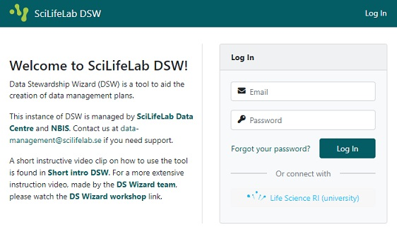
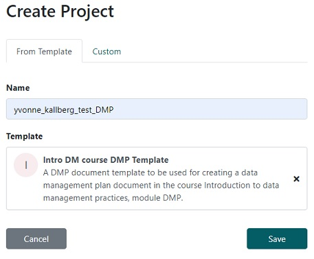
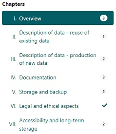
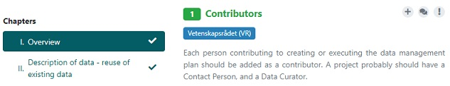
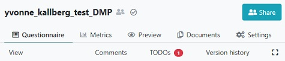

## Instructions
Follow the instructions below in order to get started

* Go to [DS wizard](https://dsw.scilifelab.se/) and log in with your university credentials by clicking on the `Life Science RI (university)` button.

* Click on `Projects` in left-hand margin 

* Click on `Create` in top right corner, name the project `<your_name>_test_DMP`, select template named `Intro DM course DMP Template` and click on `Save`

> ## Note
>
> * For the purpose of this learning module, a special project template has been created, in order to better demonstrate tool. In this template, some of the questions are already answered. If you instead want to write a full DMP, we recommend using a template called Vetenskapsrådet DMP Template.
> 
> * We will (eventually) delete all projects using this course-specific knowledge model.
> 
> * There is a more thourough guide of the wizard in the left-side margin **[Guide - Write a DMP](https://dsw.scilifelab.se/appendix/dsw_instructions/)**
{: .callout}

## About the tool
* The answers will be saved automatically.

*  Under most of the questions you will find guidance or advice on how to answer or what to consider. 

* For some questions you may provide more than one answer. If you want to add a new answer click the `Add` button at the end of your last answer.
 
    * When using `Add` button you might need scroll up in order to get to the first field to be filled.
    

You are now ready to answer the questions using the provided scenario below. Answer the questions in red (these are the questions that should be answered during the selected phase, questions which belong to other phases are in black, and questions already answered are in green).

> ## Scenario
>
> **SARS-CoV-2 genomic surveillance in Italy**
>
> Principal investigator Sam Smith (sam.smith@example.com) at Uppsala University and [you; as a researcher and contact person], wish to do RNA sequencing of nasopharyngeal swab samples taken at a hospital in Italy as part of genomic surveillance of severe acute respiratory syndrome coronavirus 2 (SARS-CoV-2). 
> Dr Smith has applied for funding at Vetenskapsrådet. The project is planned to start a month from now and continue for seven months. [you] will attend the course ‘Introduction to data management practices’ given by NBIS in order to ensure the data management quality.
> 
> The RNA sequencing will be done at the national sequencing facility NGI on Illumina NextSeq 500, a well described and known next-generation sequencing instrument. The sequencing will be made on 91 samples, producing .fastq files with a total size of ~50 GB. The data format is standard for this type of data, no specific software is required for reading, which enables sharing and long-term preservation. In addition to the sequence datasets, the sequences will be mapped to a reference genome of SARS-CoV-2 from isolate Wuhan-Hu-1, available at [https://www.ncbi.nlm.nih.gov/nuccore/NC_045512.2](https://www.ncbi.nlm.nih.gov/nuccore/NC_045512.2). This is a versioned dataset, of which version 2 will be the one used, even if newer versions are released.
> 
> In order to ensure experiment quality, calibrating measurements and repeat samples will be done. The steps of the sample collecting will be documented using the university electronic lab notebook system. The research team will use the ENA virus pathogen reporting standard checklist [ERC000033](https://www.ebi.ac.uk/ena/browser/view/ERC000033), which is a minimum metadata standard developed for submission of virus surveillance and outbreak. In addition, the file organisation and naming conventions will be documented in a README text file that will be put in the root folder of the project, and a dictionary of the sample metadata will be created.
> 
> The analysis will be done by the research group at the SNIC center Uppmax, for which a project will be applied for. 
> 
> This project adheres to Open Science and FAIR principles, so the sequencing datasets will be published in European Nucleotide Archive (ENA) at the time of arrival, and will be put under an embargo for one year until the analysis has been done and a paper has been submitted to a publisher. This way the datasets will be backed-up at a remote location, separate from the Uppmax account. The dataset will receive a persistent identifier and be available under a Creative Commons Zero license.
{: .solution}

> ## Note
>
> Notice that once a question has been answered, it becomes green and the chapter 
> display becomes ticked instead of showing the number of questions that should be 
> answered.
>
> 
{: .callout}

> ## Add a TODO (optional)
> The tool has a TODO function, which lets you mark questions where an action is necessary.
>
> * Click on `I. Overview` in the `Chapters` display menu and go to 
> the question `1. Contributors`
>
> 
>
> * Click on the `+` sign next to the question.
>
> * Notice that you now have 1 TODOs in top of the page.
>
> 
{: .solution}

> ## Solution
> 
> Please find a pre-filled DMP here: 
> [https://dsw.scilifelab.se/projects/9e96f8a0-9422-449a-bf72-81dea7a9cd9d](https://dsw.scilifelab.se/projects/9e96f8a0-9422-449a-bf72-81dea7a9cd9d)
{: .solution}


