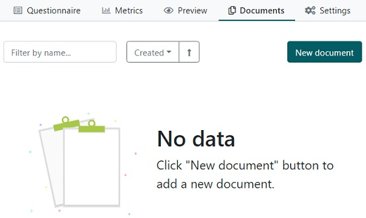
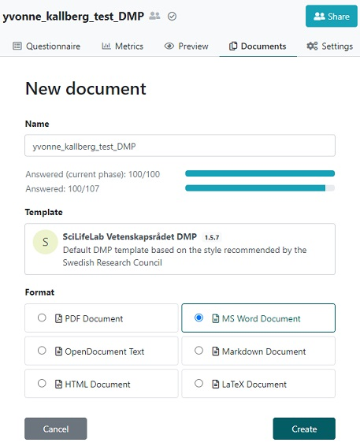
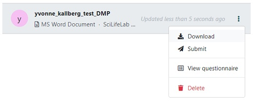
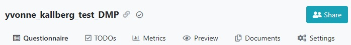
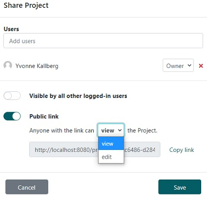

## Create a document
When the questions are answered it is time to produce the document with the DMP.

* Click on `Documents` in the navigation bar in the top of the page, and then click on the `New document` button.

* In this view your can change document name, template and output format, but we are happy with the default settings. Click `Create`. 

* To inspect the resulting document, click on the three vertical dots to the left of the document and select `Download` in the appearing menu.

* Open the downloaded document on your computer, notice how the answers you provided has been gathered to provide answers that fit the format of [Vetenskapsrådets DMP template](https://www.vr.se/english/applying-for-funding/requirements-terms-and-conditions/producing-a-data-management-plan/data-management-plan-template.html).

> ## Solution
> Follow this link to see an example output: [yvonne_kallberg_testDMP.pdf](../files/yvonne_kallberg_test_DMP.pdf)
{: .solution}

> ## How to collaborate (Optional)
> There might be situations where you want to share a link to a DMP:
>
> * Collaborators in the project needs to answer some questions
> 
> * A stakeholder want to view the answers
> 
> In order to make this possible, click on `Share` in the top right corner of the navigation bar.
>
> 
>
> There are three ways of sharing: Add user, enable visibility, and creating a public link.
>
> Activate the `Public link` and select if you want the person with the link to **view** or **edit**, click on `Save`. 
>
> 
>
> Now you can copy the link in the address bar (e.g. [https://dsw.scilifelab.se/projects/07d3fb1c-5941-4ac4-98c2-39409573bbb0](https://dsw.scilifelab.se/projects/07d3fb1c-5941-4ac4-98c2-39409573bbb0)) and share with whomever you want, without them having to log in!
>
> **Note:** We recommend to only allow anonymous users (i.e. those not specifically added to the project) to view, not edit. If you need a collaborator to add or update information in the project, use the `Add user` functionality instead.
{: .solution}
